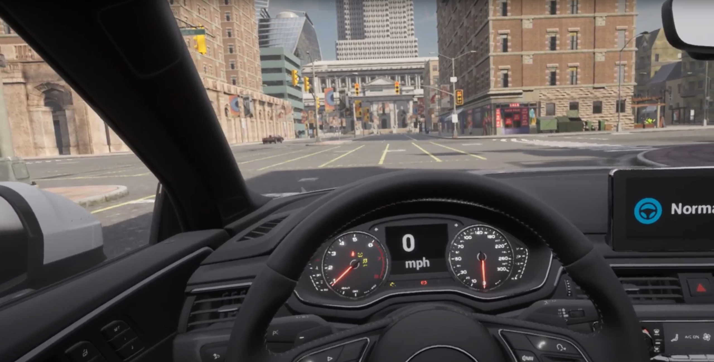

# CARLA XR Documentation

Welcome to the CARLA XR documentation.

This project adds Extended Reality functionalities for educating autonomous driving on CARLA, an open-source autonomous driving simulator. It is based on CARLA 0.9.13. The platform of development is Windows PC with Oculus Quest2 headset. Although the primary headset in use for this project is Oculus Quest2, since the development is based on OpenXR rather than the proprietary plugin from Oculus, the result should be easy to transfer to other headsets as well.

## Getting Started
This section contains guidance for setting up the software environment and run the simulation scenarios.

[__Dependencies Installation__](dep_installation.md) — Install the CARLA fork of Unreal Engine 4.26 and other dependencies.  
[__Run XR Simulation__](run_simulation.md) — Procedures to run the simulation in XR.  

## XR Implementations
This section contains the technical details for implementing XR functionalities to CARLA. Information in this section might be helpful for future development.

[__Preparation and Environment Setup__](preparation_and_env_setup.md) — Preparation before development based on stock CARLA.  
[__VR Camera Attachment__](vr_cam_attachment.md) — Primary component to turn CARLA into VR.   
[__Vehicle Mesh Rendering and Collision__](vel_mesh_render_n_collision.md) — The separation of  high-fidelity rendering and collision handling.  
[__Animation and User Interaction__](anim_n_interact.md) — The implementation of vehicle animation and feedback.  
[__Mixed Reality__](mr.md) — The undesireable implementation of mixed reality.  

## References
* [CARLA Documentation](https://carla.readthedocs.io/en/latest/build_windows/)
* [Unreal Engine Oculus Prerequisites](https://docs.unrealengine.com/4.26/en-US/SharingAndReleasing/XRDevelopment/VR/OculusVR/OculusRift/Prerequisites/)
* [Unreal Engine OpenXR Prerequisites](https://docs.unrealengine.com/4.26/en-US/SharingAndReleasing/XRDevelopment/OpenXR/openxr_prerequisites/)
* [Car Configurator](https://www.unrealengine.com/marketplace/en-US/product/automotive-configurator-01)
* [VaRest](https://github.com/ufna/VaRest)
* [Spout](https://leadedge.github.io/)

## TEST
This is a test section

## TEST2
This is another test function
