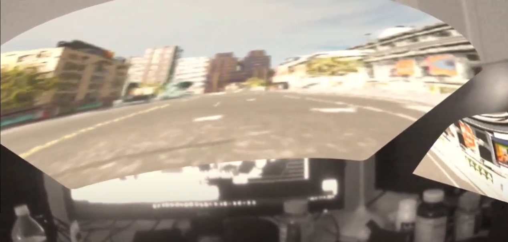

# Mixed Reality
This project also attempted to implement Mixed Reality (MR) to CARLA using Oculus Quest 2. However, at this stage Oculus does not support passthrough API for UE 4.26. It has been achieved using a workaround, but the result is not satisfying.

The MR was indirectly implemented using Unity since Oculus provides passthrough API to all Unity versions after 2019. To do so, an empty Unity project was created, and three meshes corresponding to the windshield and two side windows were modeled using Blender. The meshes were imported into the Unity project and applied rendered texture onto it. The rendered texture receives an image using a protocol called NDI. Because the official NDI support for Unreal Engine stopped at UE 4.23, another workaround must be implemented to transfer the video output from Unreal Engine to the Unity NDI receiver. On the Unreal Engine side, another protocol called Spout was implemented as the sender. Then, SpoutToNDI, software provided on the Spout official website was used to transform the Unreal Spout sender into an NDI sender. In this way, Unity can receive video output from Unreal. 

However, as the above illustration shows, the entire process is highly convoluted with two protocols. The video quality is severely degraded when Unity receives it. Although the two protocols are free to use, because of their opaque nature, it is also hard to optimize based on two protocols.  Therefore, new approaches need to become up with and implemented. 

