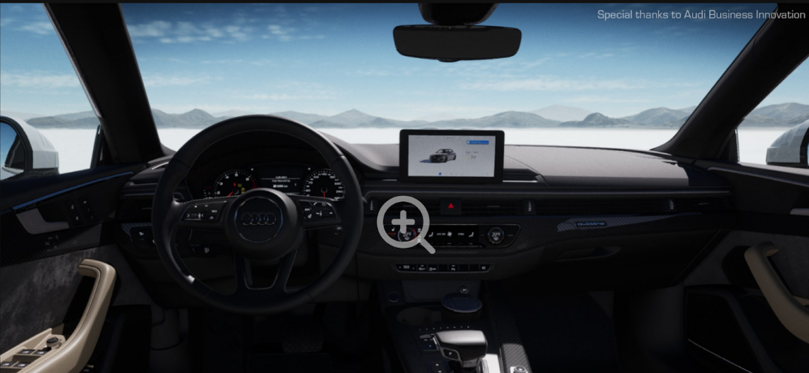
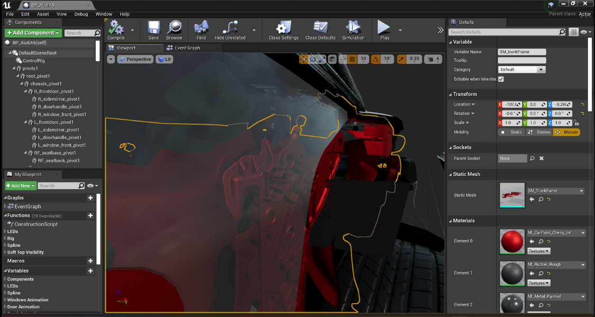
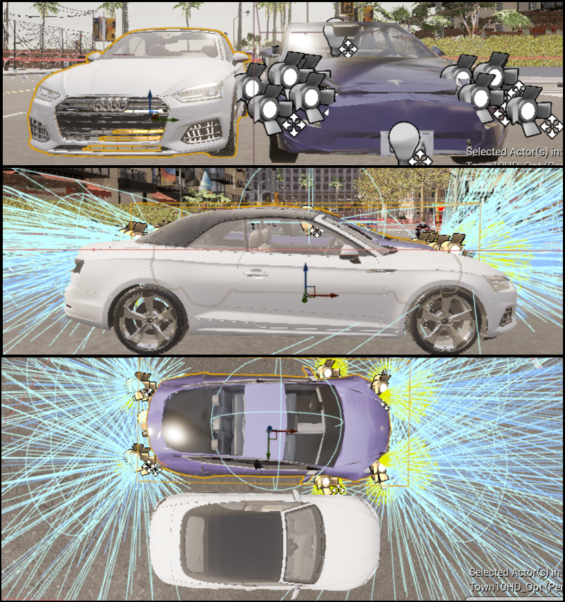

# Vehicle Mesh Rendering and Collision

CARLA is designed primarily for autonomous driving research and used in third-person perspective, bird`s-eye view, or even without rendering. Therefore, the vehicle meshes and textures that come with CARLA have a low Level of Detail (LOD). To extend it as a VR application, a high LOD vehicle model should be imported and adjusted to be suitable in the CARLA environment.

After searching and comparison on a variety of models from Unreal Marketplace and TurboSquid, an Audi A6 model from the Car Configurator project, which is licensed for free to use when working with Unreal Engine, developed by Epic Games and Audi was chosen. The model was extracted from the Car Configurator project after cleaning irrelevant Blueprint nodes inside the Car Configurator project. 

Unlike the Car Configurator project, it is unnecessary and unable for users of a VR autonomous driving simulator to see some components for functionalities, such as the engine and machine for the retractable top. Keeping them would consume much computational power as more polygons need to be rendered at every frame, which is amplified when using stereo rendering per frame in VR. Therefore, imperceptible components in VR were removed before importing the model to CARLA.

CARLA stores vehicles as Blueprint classes. Each vehicle Blueprint contains a set of sensors for autonomous driving, and each four-wheeled vehicle was rigged with the same base skeleton. To avoid potential conflicts between mesh and skeleton when rigging and incompatibilities between mesh and sensor Blueprint, the vehicle mesh rendering and collision were handled separately. 

Because Audi A6, the model extracted from the Car Configurator, and Tesla Model 3, a vehicle Blueprint class already inside the CARLA project, has roughly the same dimension and hitbox both visually and physically, the Tesla Model 3 Blueprint was chosen to be responsible for handling collision. The initialization procedures were also programmed in the AutoAttachedCamera Blueprint. When a player-controlled Tesla Model 3 is spawned, besides repositioning the VR camera, the AutoAttachedCamera Blueprint also disables the mesh rendering of the low LOD Tesla Model 3, spawns the high LOD Audi A6, and disables its collider. This method can not only avoid the potential conflicts among mesh, skeleton, and Blueprint sensors but also can optimize the performance by showing the high-fidelity model and calculating the collisions using considerably fewer polygons.

