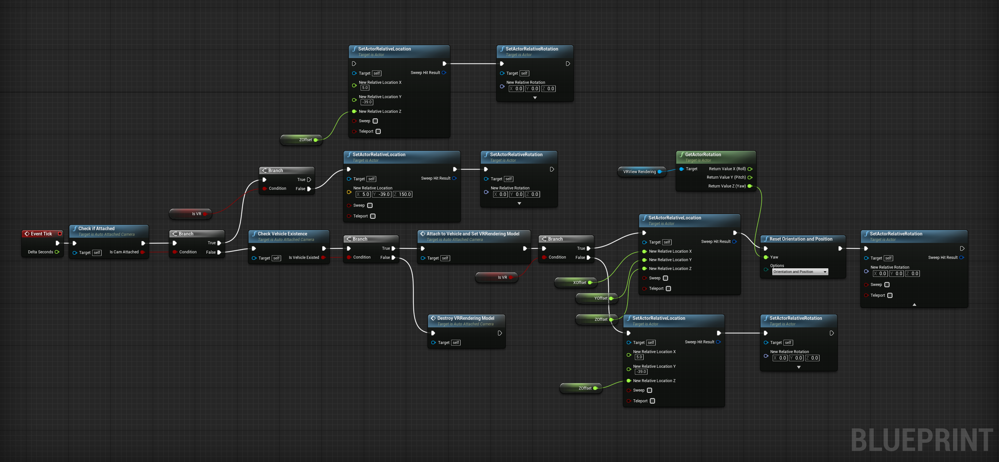

# VR Camera Attachment

The CARLA project was originally designed to use Unreal Engine purely for the environment and handle events and video output using Pygame. It is hard to implement VR directly on the client-side as Pygame barely has VR support. Therefore, VR was implemented on the server. 

To solve the discrepancy between client spawning event and server VR video output, a Blueprint class, which is a unique data structure when programming using Blueprint, the visualized programming interface inside Unreal Engine, named AutoAttachedCamera was developed, which is responsible for checking if the player vehicle exists and attach it to the spawned player vehicle automatically. it checks if a player-controlled vehicle exists and if it already attached itself to a vehicle at every frame. If a player-controller vehicle exists and it is not attached yet, it will transform itself into the driver seat of the vehicle. It also works after destroying the previous player vehicle and initializing a new one multiple times. In this way, the spawning event was properly handled between client and server.

